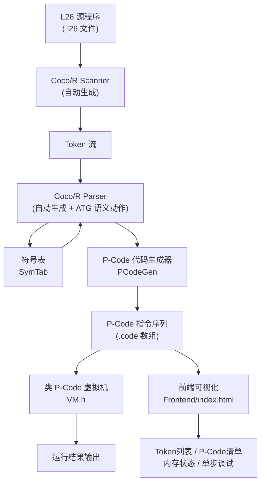

# L26 编译器 — 技术架构方案

> 路径：`F:\L26Compiler-workbuddy\02-技术架构.md`
> 第三组 · Coco/R 实现 · 2026 年《编译原理与实践》大作业

---

## 1. 技术栈总览

| 层次 | 技术 | 说明 |
|------|------|------|
| 文法描述 | Coco/R ATG | `L26.atg`，包含 CHARACTERS / TOKENS / PRODUCTIONS + 嵌入语义动作 |
| 词法/语法生成 | Coco/R (coco.exe) | 自动生成 `Scanner.cpp` / `Parser.cpp` |
| 语义分析 | 手工 C++ 模块 | `SymTab.h`（符号表）+ ATG 语义动作 |
| 中间代码 | 类 P-Code | `PCode.h`（指令集 + 代码生成器） |
| 虚拟机 | C++ | `VM.h`（基于操作数栈的解释执行器） |
| 前端可视化 | 纯 HTML/CSS/JS | `Frontend/index.html`（双击即用） |
| 构建 | MinGW g++ + Makefile | `Compiler/Makefile` |

---

## 2. 分层架构（Pipeline）



---

## 3. 核心数据结构

### 3.1 符号表（`SymTab.h`）

**栈式多级作用域设计**，支持 L26 嵌套块（`<block>`）的变量遮蔽语义：

```
SymTab
├── scopes: vector<map<string, SymEntry>>
│   ├── scopes[0]: 最外层（第 0 级）
│   │   ├── "x" → {type:"int", level:0, offset:0}
│   │   └── "s" → {type:"set", level:0, offset:1}
│   └── scopes[1]: 嵌套块（第 1 级）
│       └── "x" → {type:"set", level:1, offset:0}  ← 遮蔽外层 x
├── curLevel: int          当前嵌套层次
└── offsetStack: vector<int>  每层块内偏移计数
```

关键操作：
- `EnterScope()` / `LeaveScope()` ：进出作用域时压栈/弹栈
- `Declare(name, type)` ：在当前层声明变量，重复声明报错
- `Lookup(name)` ：向上逐层查找，返回最近的绑定（实现变量遮蔽）

### 3.2 P-Code 指令（`PCode.h`）

采用**标准 PL/0 三字段格式**：

```
PInstr {
    fct  f;    /* 指令功能码（8 种：LIT/OPR/LOD/STO/CAL/INT/JMP/JPC） */
    int  l;    /* 层次差（静态链向上跳几层，LIT/INT/JMP/JPC 时为 0）   */
    int  a;    /* 操作数（字面量值 / 偏移量 / 跳转地址 / OPR 子码）    */
}
```

8 种基本指令：

| 指令 | 语义 |
|------|------|
| `LIT 0 a` | 将常数 a 压入栈顶 |
| `OPR 0 x` | 执行 OPR 子码 x 对应的运算（见下表） |
| `LOD l a` | 将静态链向上 l 层、偏移 a 处的变量值压栈 |
| `STO l a` | 弹出栈顶，存入静态链向上 l 层、偏移 a 处 |
| `CAL l a` | 调用静态链向上 l 层的过程（L26 暂不使用） |
| `INT 0 a` | 在栈顶分配 a 个单元（过程/块活动记录） |
| `JMP 0 a` | 无条件跳转到地址 a |
| `JPC 0 a` | 弹出栈顶，若为 0（假）则跳转到地址 a |

OPR 子码（`OPR 0 x`）：

** 标准子码（0–17）：**

| x | 运算 | x | 运算 |
|---|------|---|------|
| 0 | RET（过程/程序返回） | 9 | NEQ（!=） |
| 1 | NEG（取负） | 10 | LSS（<） |
| 2 | ADD（+） | 11 | LEQ（<=） |
| 3 | SUB（-） | 12 | GTR（>） |
| 4 | MUL（*） | 13 | GEQ（>=） |
| 5 | DIV（/） | 14 | WRIT_BOOL（输出布尔） |
| 6 | MOD（%） | 15 | WRIT_SET（输出集合） |
| 7 | ODD（奇数测试） | 16 | READ（读输入压栈） |
| 8 | EQL（==） | 17 | WRIT（输出整数） |

**L26 扩展子码（≥18）：**

| x | 运算 | 说明 |
|---|------|------|
| 18 | AND | 逻辑与 |
| 19 | OR | 逻辑或 |
| 20 | NOT | 逻辑非 |
| 21 | LT（<） | 关系比较 |
| 22 | LE（<=） | 关系比较 |
| 23 | GT（>） | 关系比较 |
| 24 | GE（>=） | 关系比较 |
| 25 | NE（!=） | 关系比较 |
| 201 | SET_MK | 构造集合字面量（弹 a 个元素） |
| 202 | SET_ADD | 集合加元素 |
| 203 | SET_REM | 集合删元素 |
| 204 | SET_UNI | 并集 |
| 205 | SET_INT | 交集 |
| 206 | SET_IN | 成员测试 |
| 207 | SET_EMP | 空集测试 |
| 208 | SET_EQ | 集合相等测试 |
| 211 | SET_NE | 集合不等测试 |

### 3.3 运行时值（`VM.h`）

虚拟机采用**标准 PL/0 整型操作数栈**：

```
int  s[2048];   /* 整型操作数栈（集合以 index 映射到 g_setPool）*/
int  p;         /* 程序计数器（Program counter）                 */
int  b;         /* 基址寄存器（Base register）                   */
int  t;         /* 栈顶寄存器（Top-of-stack pointer）            */
```

活动记录布局（INT 0 a 分配 a 个槽，其中前 3 个为联系单元）：

```
s[b+0] = SL（Static Link，外层过程基址）
s[b+1] = DL（Dynamic Link，调用方基址）
s[b+2] = RA（Return Address，返回地址）
s[b+3] = 第 1 个本地变量
s[b+4] = 第 2 个本地变量
...
```

集合类型用 `g_setPool[t]`（以栈下标为 key）辅助存储，不影响整型栈结构。

---

## 4. Coco/R ATG 文法设计与扩展说明

### 4.1 ATG 文件结构

```
COMPILER L26           ← 编译器名称（同时是起始产生式名称）
  $namespace=...       ← 命名空间配置（唯一有效的 $ 指令）
  /* 成员变量、辅助函数、Init() 直接写在 COMPILER 段内 */
CHARACTERS             ← 字符集定义
TOKENS                 ← Token 类型定义
COMMENTS               ← 注释定义（扩展：支持 // 和 /* */）
IGNORE                 ← 忽略字符
PRODUCTIONS            ← 产生式（含嵌入语义动作 (. ... .)）
END L26.
```

### 4.2 LL(1) 冲突解决策略

L26 的 `Expr` 有三个分支（`SetExpr`, `AExpr`, `BExpr`），存在 LL(1) 歧义。本实现采用**前置谓词 + 后置检查**混合策略：

| 策略 | 适用场景 | 实现方式 |
|------|----------|----------|
| **前置谓词** | 仅用于无法被 `AExpr` 匹配的 token | `IsSetExprStart()` 检测 `{`；`IsAExprStart()` 检测 ident/number/`(`/`-` |
| **后置检查** | 对于 ident 的歧义 | 先调用 `AExpr` 消费 ident，再用 `[ ... ]` 检查下一个 token（`union`/`inter`/`in`/relop） |

**关键陷阱**：Coco/R C++ 版运行时 `la->next` 始终为 NULL，所有前置谓词只能检查 `la->kind`，不能依赖 2-token 前瞻。因此 `ident union/inter`、`AExpr "in" ident`、`AExpr relop AExpr` 的歧义全部在 `Expr`/`BFactor` 产生式中用后置 `[ ... ]` 可选块解决。

### 4.3 BFactor 重构

原始文法中 `Rel`、`SetTest`、单独 bool 变量分别独立，存在 LL(1) 冲突。重构后将三者统一为 `AExpr + 后置 [ ... ]` 模式：

```
BFactor = "true" | "false" | "!" BFactor | "(" BExpr ")"
        | "isempty" "(" ident ")"
        | AExpr<dummy> [ "in" ident | relop AExpr ]
```

`Rel` 和 `SetTest` 产生式已从 ATG 中删除，逻辑完全内联到 `BFactor` 和 `Expr` 中。

### 4.4 扩展文法一览

| 功能 | 标注 | ATG 体现 |
|------|------|----------|
| int/bool/set 类型 | 【原生文法】 | `Type` 产生式 |
| 嵌套作用域 | 【原生文法】 | `Block` + `EnterScope/LeaveScope` |
| set 字面量 `{1,2,3}` | 【原生文法】 | `SetExpr` + `OPR 0 201`（SET_MK）指令 |
| `add` / `remove` | 【原生文法】 | `SetOpStmt` |
| `in` / `isempty` | 【原生文法】 | `BFactor` 内联 `SetTest` 逻辑 |
| `union` / `inter` | 【原生文法】 | `Expr` 后置 `[ "union" ident | "inter" ident ]` |
| `//` 和 `/* */` 注释 | 【扩展优化】 | `COMMENTS FROM "//"...` |
| 集合相等/不等判断 | 【扩展优化】 | `OPR 0 208`（SET_EQ）/ `OPR 0 211`（SET_NE）；编译器在 `==` / `!=` 操作数类型为 set 时自动切换 |

---

## 5. 代码生成策略

### 5.1 条件跳转的回填机制

```
if (cond) stmt1 [else stmt2]
→
  [编译 cond]
  JPC 0 ?      ← 回填点 labelElse（假则跳过 stmt1）
  [编译 stmt1]
  JMP 0 ?      ← 回填点 labelEnd
  PATCH(labelElse, cur)
  [编译 stmt2（若有）]
  PATCH(labelEnd, cur)
```

### 5.2 while 循环

```
while (cond) stmt
→
  labelTop = cur
  [编译 cond]
  JPC 0 labelEnd  ← 回填
  [编译 stmt]
  JMP 0 labelTop
  PATCH(labelEnd, cur)
```

### 5.3 集合字面量

```
s = {1, 2, 3}
→
  LIT 0 1        ← 压入 1
  LIT 0 2        ← 压入 2
  LIT 0 3        ← 压入 3
  OPR 0 201      ← SET_MK，弹 3 个元素构造集合
  STO 0 a        ← 存入变量 s（a = s 的偏移 + 3）
```

### 5.4 集合相等/不等（类型感知）

```
s == t         （s 和 t 均为 set 类型）
→
  LOD 0 a       ← 加载 s（栈上存 set pool index）
  LOD 0 b       ← 加载 t
  OPR 0 208     ← SET_EQ（VM 内用 C++ std::set::operator== 逐元素比较）
```

代码生成端在 `Expr` 和 `BFactor` 的 relop 语义动作中，通过检测 `prevTyp == "set"` 自动选择 `EmitSetEQ()` / `EmitSetNE()` 而非整数 `EmitRelOp()`。

---

## 6. 前端架构

前端 `index.html` 是**自包含单文件应用**，所有逻辑用原生 JavaScript 实现，无外部依赖：

```
index.html
├── Lexer（JS 词法分析器）        → 生成 Token 列表并可视化
├── Compiler（递归下降 + 代码生成）→ 生成 P-Code 并展示
├── VM（JS 虚拟机）               → 全速运行 / 单步执行
│   └── 异步 promptInput()        → 弹窗收集 read 语句输入
├── renderTokens()               → Token 表格
├── renderPCode()                → P-Code 表格 + 高亮当前 PC
└── renderMemory()               → 实时显示帧变量
```
